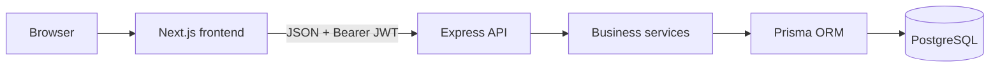
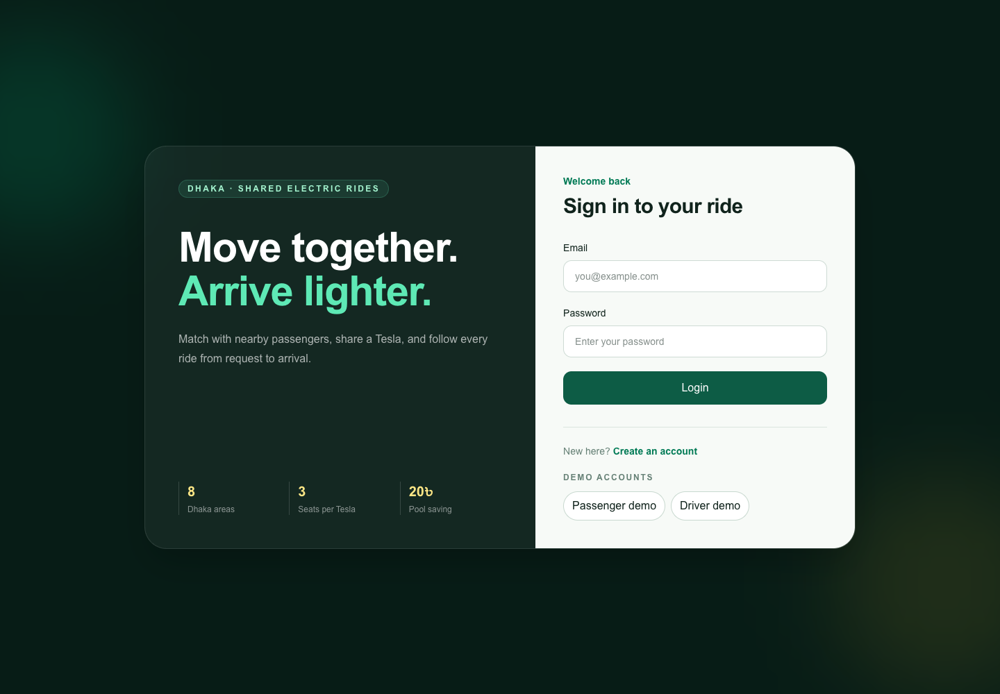
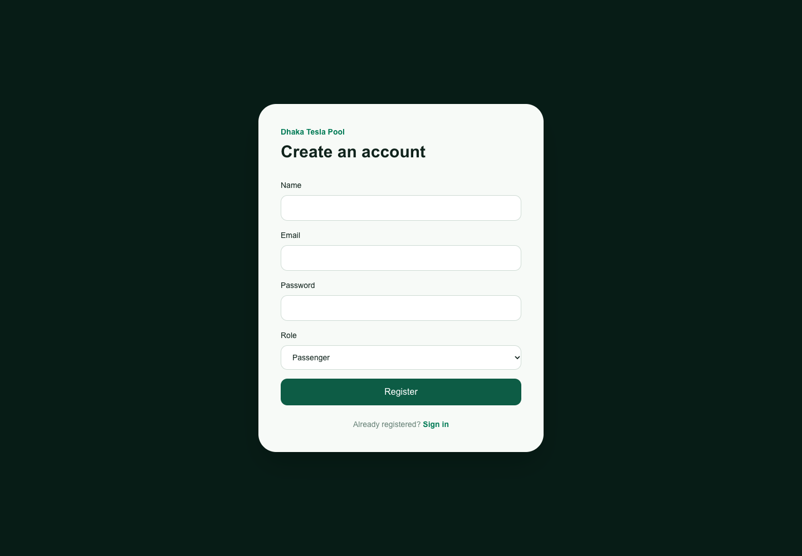
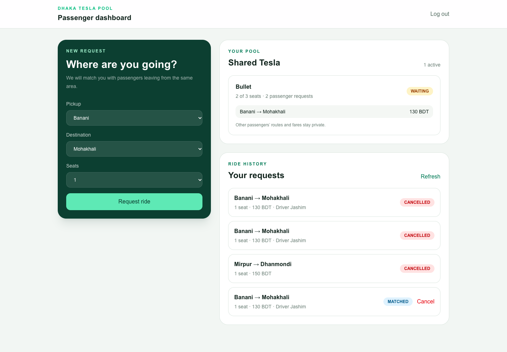
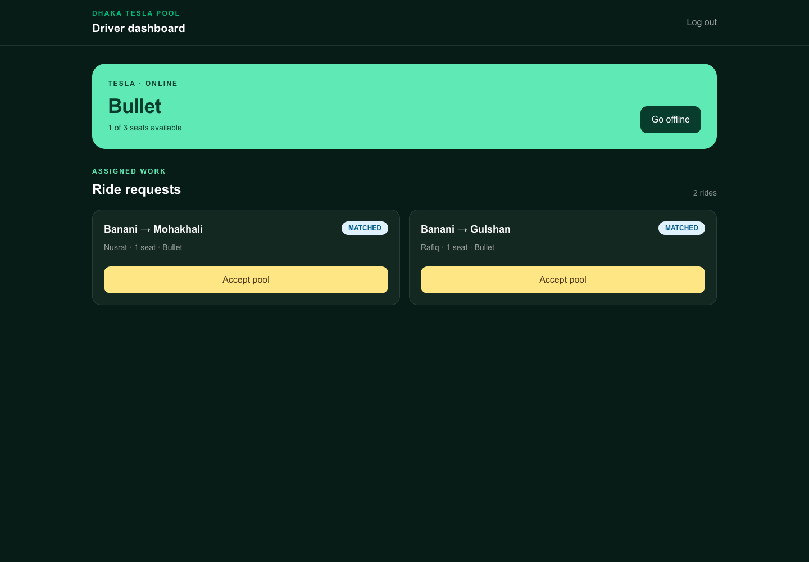

# Dhaka Tesla Pool

Dhaka Tesla Pool is a full-stack ride-pooling prototype that groups passengers
leaving from the same Dhaka area into an available Tesla. It demonstrates
authentication, capacity-safe matching, pooled fares and tips, ride status tracking,
containerized deployment, and responsive passenger and driver interfaces.

## Current status

The passenger, driver lifecycle, matching, fare, authentication, database,
seed, frontend, and Docker flows are implemented.

## Live deployment

- Frontend: <https://dhaka-tesla-pool-three.vercel.app>
- API: <https://dhaka-tesla-pool-api-mahir.onrender.com>

## Features

### Passenger

- Register and log in with JWT authentication.
- Request rides across nine predefined Dhaka areas, including Gulshan 1.
- Join a same-pickup Tesla pool without exceeding capacity.
- View current pools, fares, statuses, and ride history.
- Follow live trip progress and add or update a tip after completion.
- View an itemized fare, tip, and total receipt.
- See only their own route, fare, and status inside a shared pool.
- Cancel owned rides while they are `REQUESTED` or `MATCHED`.

### Pooling and fares

- Online Tesla selection with three-seat demo capacity.
- Same-pickup and nearby-destination matching using committed Dhaka coordinates.
- Compatible passengers may join a waiting or accepted pool until departure.
- Queued requests are automatically reconsidered when a driver becomes available.
- Serializable matching transactions with retry protection.
- Automatic `REQUESTED → MATCHED` transition.
- Base fare, distance charge, and flat pool discount stored in integer paisa.
- Seat release and empty-pool cleanup after cancellation.
- Persisted ride-status history for lifecycle auditing.

### Driver

- View rides assigned to the authenticated driver's Tesla.
- Go online/offline and see live capacity (offline is blocked during an active pool).
- Accept waiting pools owned by that driver.
- Mark arrival, start rides, and complete rides through validated transitions.
- Cancel a matched ride and use the role-protected generic status endpoint.
- Automatically complete a pool after all member rides finish.
- View completed trips, passenger assignments, tips, and total earnings.

### Frontend

- Role-aware login and dashboard redirects.
- Session restoration across refresh and browser Back/Forward navigation.
- Passenger request, pool, cancellation, and history views.
- Driver pool acceptance and ride lifecycle controls.
- Five-second passenger/driver polling for cross-role status and tip updates.
- Loading, success, error, and empty states.

## Technology

| Layer | Technology |
| --- | --- |
| Frontend | Next.js 16, React 19, TypeScript, Tailwind CSS, Axios |
| Backend | Node.js, Express 5, TypeScript |
| Data | PostgreSQL, Prisma 7, `@prisma/adapter-pg` |
| Authentication | JWT, bcrypt |
| Testing | Node.js test runner, strict assertions |
| Operations | Docker, Docker Compose |

## Architecture



See [Architecture](docs/architecture.md), [ERD](docs/erd.md), and the complete
[API reference](docs/API.md) for detailed diagrams and request examples.
The [evaluation checklist](docs/evaluation-checklist.md) maps every requested
area to its implementation and identifies the remaining submission-only work.

For a public demo, follow the [free deployment guide](docs/deployment.md) to
host PostgreSQL on Neon, the API on Render, and the frontend on Vercel.

## Screenshots

The following presentation-ready states were captured from the live deployment:

### Login



### Registration



### Passenger dashboard and private pool view



### Driver dashboard



## Local setup

### Prerequisites

- Node.js 22 or newer
- npm 11 or newer
- PostgreSQL 16 or newer

### Backend

```bash
cd backend
npm ci
```

Create `backend/.env`:

```env
PORT=5000
DATABASE_URL="postgresql://YOUR_USER@localhost:5432/dhaka_tesla_pool"
DATABASE_URL_UNPOOLED="postgresql://YOUR_USER@localhost:5432/dhaka_tesla_pool"
JWT_SECRET="replace_with_a_long_random_secret"
CORS_ORIGINS="http://localhost:3000"
```

Create the database, apply migrations, seed it, and start the API:

```bash
createdb dhaka_tesla_pool
npx prisma migrate deploy
npm run prisma:seed
npm run dev
```

The API defaults to `http://localhost:5000`.

### Frontend

```bash
cd frontend
npm ci
cp .env.example .env.local
npm run dev
```

The app is available at `http://localhost:3000`.

## Demo accounts

All seeded accounts use password `password123`.

| Role | Name | Email |
| --- | --- | --- |
| Driver | Jashim | `jashim@test.com` |
| Passenger | Nusrat | `nusrat@test.com` |
| Passenger | Rafiq | `rafiq@test.com` |
| Passenger | Shirin | `shirin@test.com` |

The seed also creates an online Tesla named **Bullet** with capacity **3**, plus
a waiting pool containing matched demo rides for Nusrat and Rafiq. Seeding is
atomic and idempotent:

```bash
cd backend
npm run prisma:seed
```

## Docker

Docker Desktop is required on macOS.

```bash
cp .env.example .env
docker compose up --build
```

Compose starts PostgreSQL, waits for it to become healthy, applies migrations,
optionally seeds demo data, starts the backend, and then starts the frontend.

| Service | Default address |
| --- | --- |
| Frontend | `http://localhost:3000` |
| Backend | `http://localhost:5000` |
| PostgreSQL | `localhost:5432` |

To stop the stack:

```bash
docker compose down
```

To remove the database volume as well:

```bash
docker compose down --volumes
```

On macOS, AirPlay Receiver may occupy port 5000. Set `BACKEND_PORT=5001` and
`NEXT_PUBLIC_API_URL=http://localhost:5001` in the root `.env` before building
if that conflict occurs.

## Database commands

```bash
cd backend
npx prisma migrate status
npx prisma migrate deploy
npm run prisma:generate
npm run prisma:seed
npx prisma studio
```

Migration files are stored in `backend/src/prisma/migrations`.

## Tests and quality checks

```bash
cd backend
npm test

cd ../frontend
npm run lint
npm run build
```

The 27 backend tests cover validation, driver onboarding, fare/receipt calculation, destination-aware
pool eligibility, Tesla capacity, serialization-conflict retries, ride
ownership, passenger privacy, tip validation, and ride state transitions.

## API

### Authentication

| Method | Endpoint | Access |
| --- | --- | --- |
| `POST` | `/auth/register` | Public |
| `POST` | `/auth/login` | Public |

### Passenger rides

| Method | Endpoint | Access |
| --- | --- | --- |
| `POST` | `/rides` | Passenger |
| `GET` | `/rides/my` | Passenger |
| `GET` | `/rides/history` | Passenger |
| `PATCH` | `/rides/:id/cancel` | Owning passenger |
| `PATCH` | `/rides/:id/tip` | Owning passenger after completion |
| `PATCH` | `/rides/:id/status` | Assigned driver |
| `GET` | `/pool/my` | Passenger |

### Driver lifecycle

| Method | Endpoint | Access |
| --- | --- | --- |
| `GET` | `/driver/rides` | Driver |
| `GET` | `/driver/dashboard` | Driver |
| `GET` | `/driver/history` | Driver |
| `PATCH` | `/driver/status` | Driver |
| `PATCH` | `/driver/pool/:id/accept` | Assigned driver |
| `PATCH` | `/driver/ride/:id/arrival` | Assigned driver |
| `PATCH` | `/driver/ride/:id/start` | Assigned driver |
| `PATCH` | `/driver/ride/:id/complete` | Assigned driver |
| `PATCH` | `/driver/ride/:id/cancel` | Assigned driver |

Authenticated requests use:

```http
Authorization: Bearer YOUR_JWT
```

### Health and middleware checks

| Method | Endpoint | Purpose |
| --- | --- | --- |
| `GET` | `/` | API availability |
| `GET` | `/health/ready` | API and database readiness |
| `GET` | `/profile` | Authentication check |
| `GET` | `/driver-only` | Driver-role check |

## Fare rule

```text
fare = base fare + distance charge - pool discount
     = 50 BDT + 100 BDT - 20 BDT
     = 130 BDT = 13,000 paisa
```

Unmatched requests initially store 15,000 paisa. Matching atomically updates
both the ride fare and individual pool fare to 13,000 paisa.
Tips are stored separately in integer paisa and never change the calculated
fare; receipts return `fare`, `tip`, and `total`.

## Decisions and trade-offs

- Nine canonical Dhaka areas and a 5 km destination-compatibility radius
  replace maps/geocoding to keep matching deterministic for the assessment.
- The distance charge is a placeholder rather than a computed route distance.
- JWTs are stateless and expire after one day.
- Pool matching uses serializable database transactions to prioritize capacity
  correctness over maximum write throughput.
- Prisma 7 keeps the datasource URL in `prisma.config.ts` and uses the official
  PostgreSQL driver adapter.

## Limitations

- No GPS tracking, traffic-aware routing, payments, or notifications.
- No refresh tokens or token revocation.
- The browser stores the demo JWT in `localStorage`; production systems should
  prefer secure, HTTP-only cookies and CSRF protection.
- Destination proximity is deterministic rather than traffic-aware route
  optimization.
- Requests left waiting without a Tesla are not retried automatically when a
  vehicle becomes available; the current prototype matches at creation time.

## AI usage

AI assistance was used to clarify requirements, review implementation choices,
debug environment-specific errors, strengthen edge-case handling, and improve
documentation. Generated suggestions were reviewed and validated with builds,
database queries, API integration checks, and automated tests.

## Demo video

[Watch the passenger and driver walkthrough](docs/demo/dhaka-tesla-pool-demo.webm).
