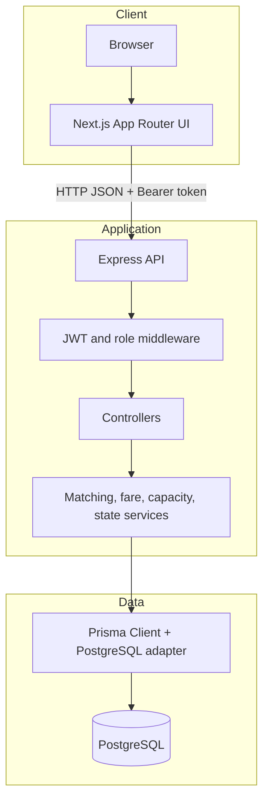
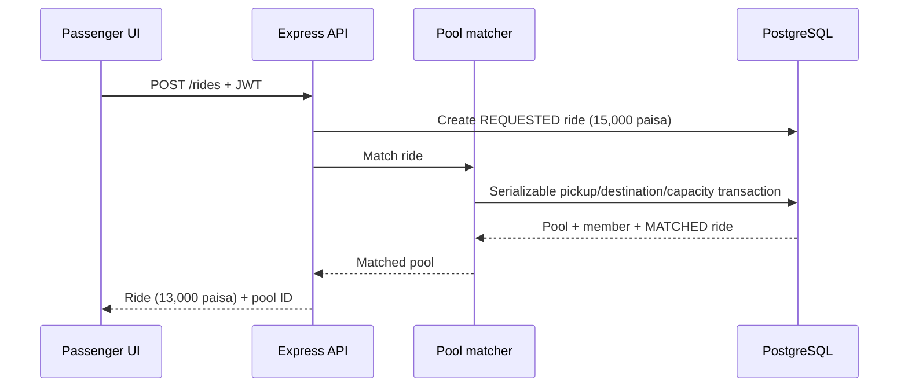
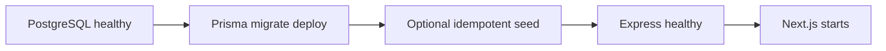
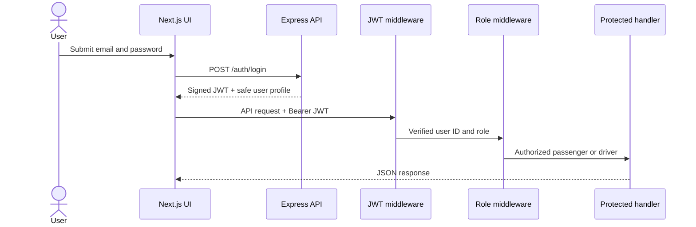

# Architecture

## Runtime topology

## Request flow

1. The Next.js client authenticates through `POST /auth/login`.
2. The browser stores the demo JWT, validates its expiry on restoration, and
   Axios attaches it to API requests.
3. Express verifies the token and enforces passenger or driver roles.
4. Controllers validate input and delegate business rules to services.
5. Prisma executes queries through the official PostgreSQL driver adapter.
6. Pool matching uses a serializable transaction and retries serialization
   conflicts to prevent concurrent seat overbooking.
7. Matching can add a compatible passenger to an accepted pool until any ride
   starts; unmatched requests are retried when driver capacity becomes free.

## Ride request sequence

## Docker startup

Compose health checks enforce this order. The browser-facing API URL is baked
into the frontend using `NEXT_PUBLIC_API_URL` during the image build.

## Authentication and authorization flow

Authentication establishes identity. Route-level role middleware then keeps
passengers out of driver endpoints and drivers out of passenger mutations.
Passenger pool projections return aggregate occupancy and the requesting
passenger's membership only; another passenger's route, fare, and status never
leave the API.

The login and registration routes redirect an already-authenticated user to
their role dashboard. Login uses history replacement, so Back/Forward and page
refresh do not present a false logged-out state. A rejected or expired JWT is
still cleared and redirected to login.

Passenger and driver dashboards poll every five seconds. Ride transitions and
tips remain authoritative in PostgreSQL; polling refreshes passenger progress,
receipts, and the driver's completed-trip earnings without sharing data between
passengers.
