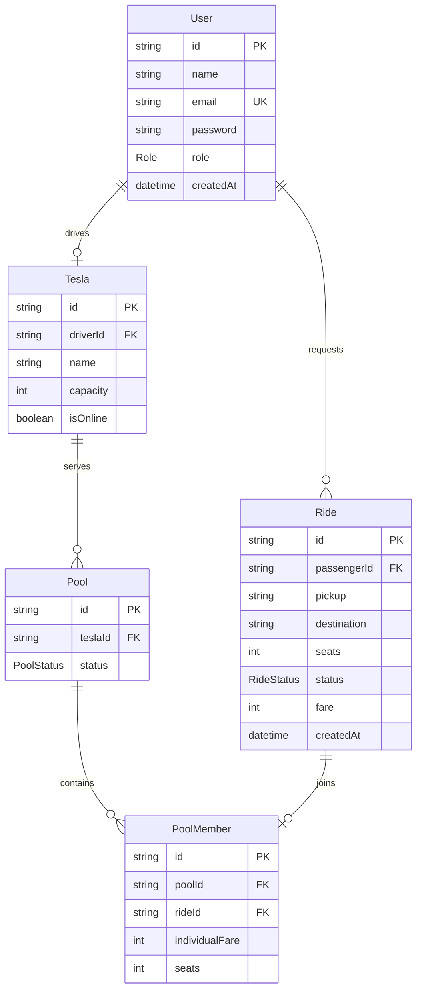

# Entity relationship diagram



## Enums

```text
Role: PASSENGER | DRIVER

RideStatus:
REQUESTED → MATCHED → DRIVER_ARRIVED → STARTED → COMPLETED
     └──────────────→ CANCELLED ←──────────────┘

PoolStatus: WAITING | ACTIVE | COMPLETED | CANCELLED
```

Money is stored as integer paisa. A ride can belong to at most one pool because
`PoolMember.rideId` is unique, and a driver can own at most one Tesla because
`Tesla.driverId` is unique.
